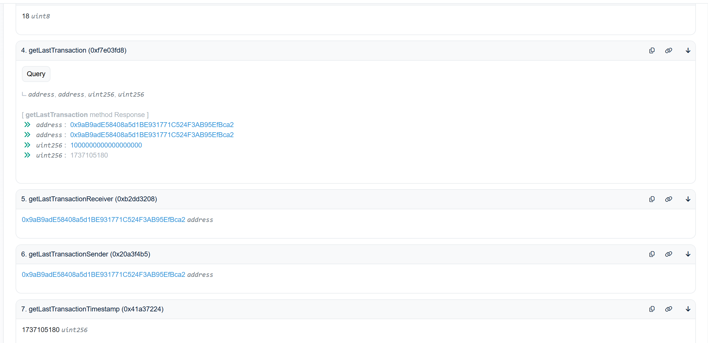
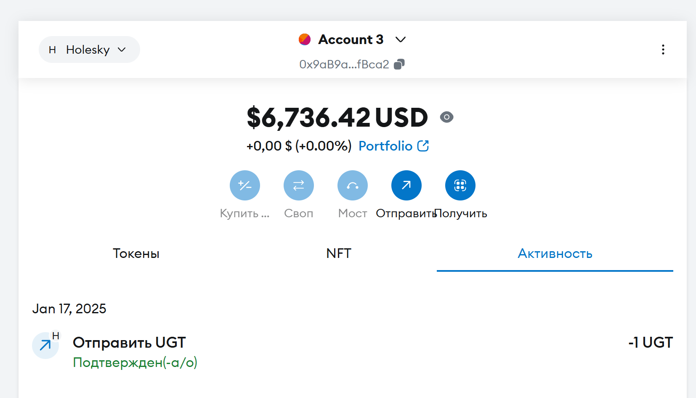
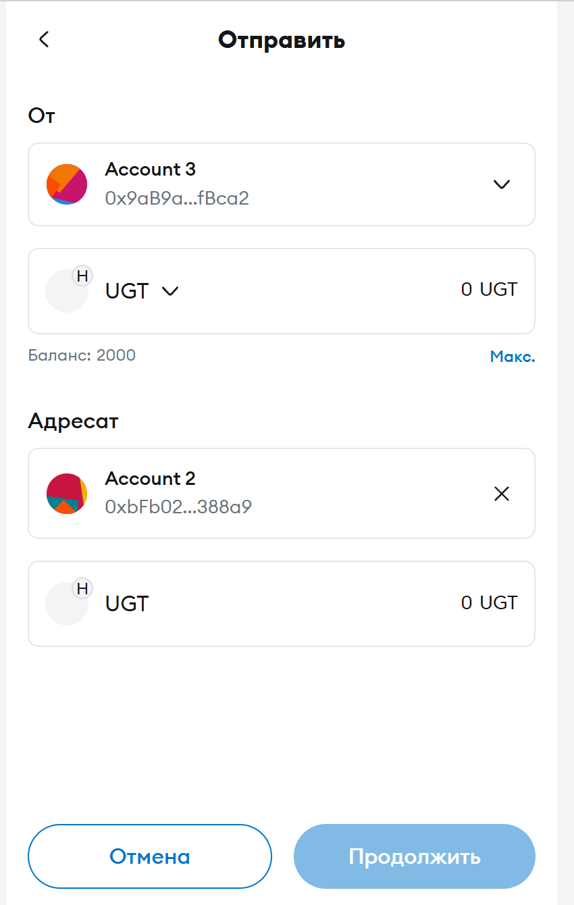
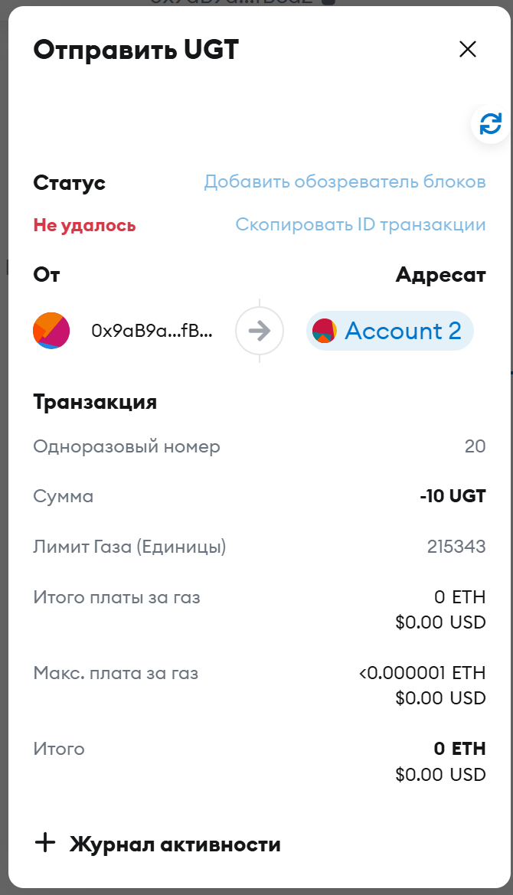
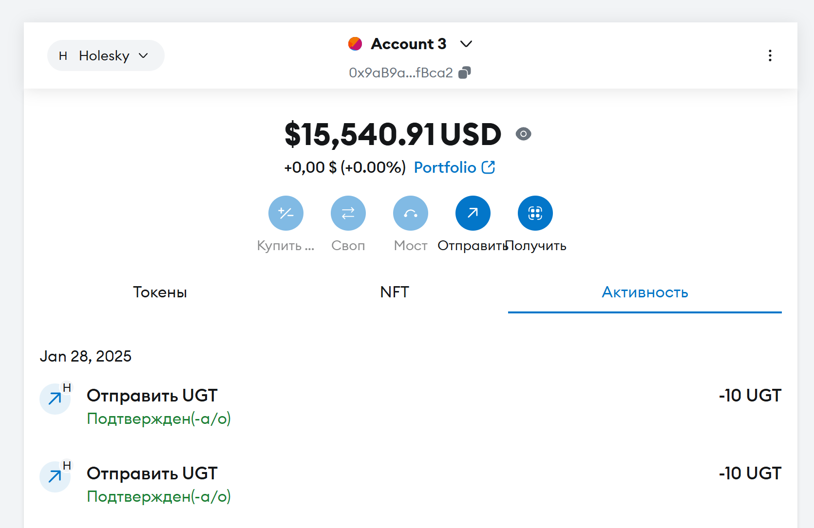
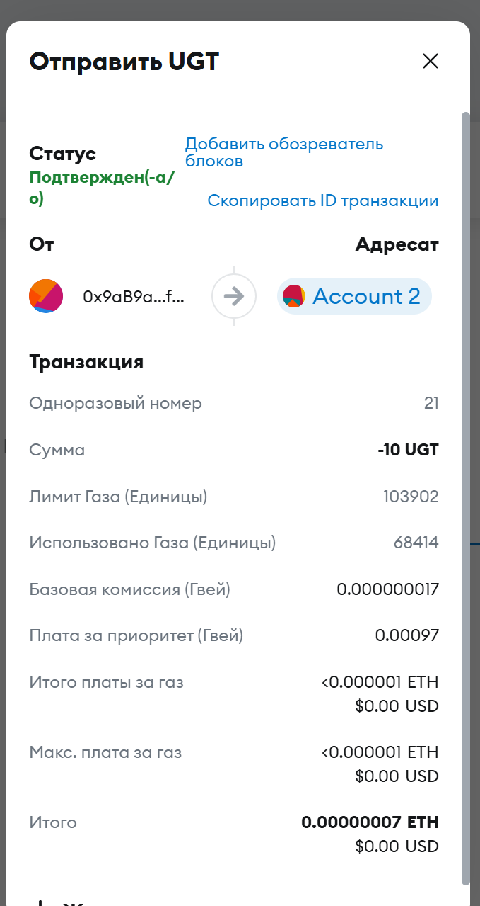
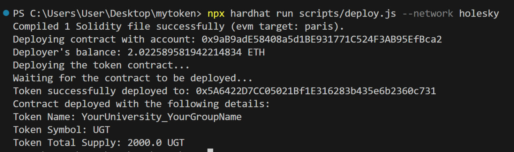
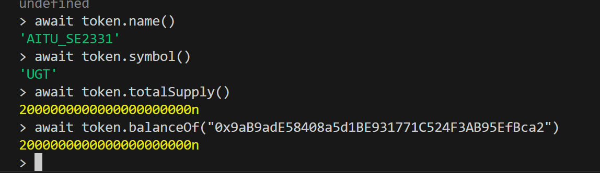
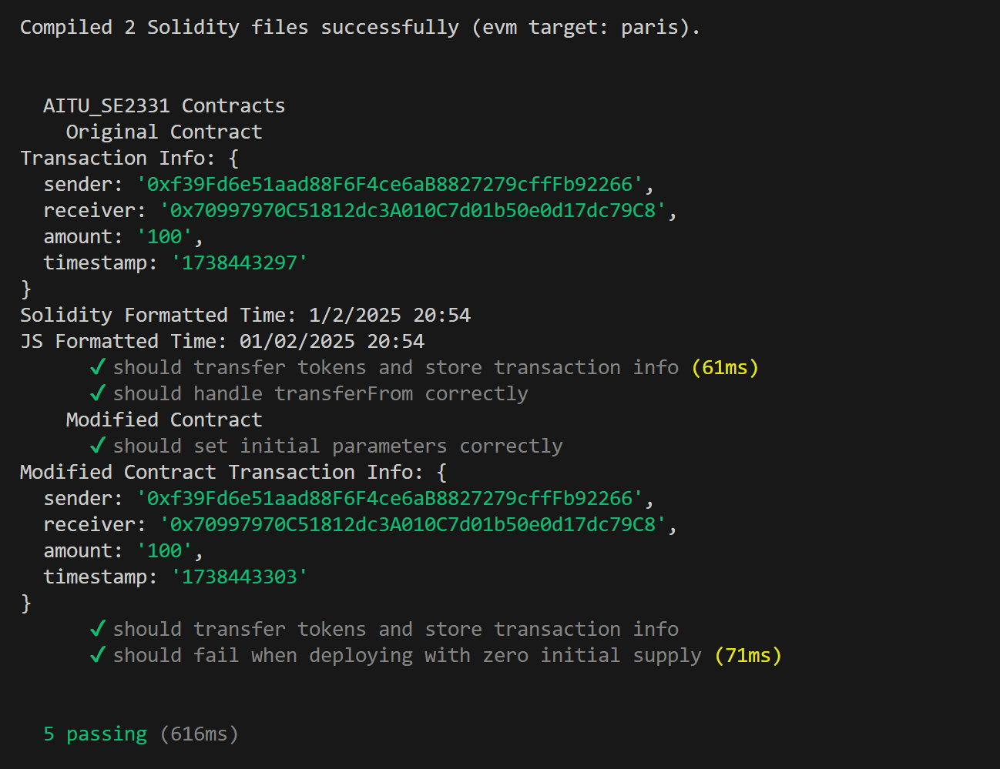

# AITU_SE2331 (UGT)

AITU_SE2331 (UGT) is an ERC20 token deployed on a blockchain network that represents a tokenized asset for university use cases. It allows the transfer of tokens between addresses and provides transaction details, including timestamps, to enhance transparency.

## Features
- **ERC20 Token**: Implements the ERC20 standard for token transfers.
- **Transaction Logging**: Emits transaction details (sender, receiver, amount, and timestamp).
- **Custom Token Information**: The token is named "AITU_SE2331" with the symbol "UGT".
- **Initial Supply**: The contract mints an initial supply of 2000 UGT tokens to the deployer's address.
- **Human-Readable Timestamps**: Converts Unix timestamps of transactions to human-readable date-time formats.

## Smart Contract Overview

### Token Name and Symbol
- **Name**: AITU_SE2331
- **Symbol**: UGT
- **Initial Supply**: 2000 UGT (with 18 decimals)

## Project Structure

```
.
├── contracts
│   ├── AITU_SE2331.sol
│   └── AITU_SE2331Modified.sol (part2)
├── scripts
│   └── deploy.js
├── test
│   └── contract-test.js (part2)
├── .env
├── hardhat.config.js
├── package.json
├── README.md
└── LICENSE
```

## Compilation

Compile the contract to ensure everything is correct:
```bash
npx hardhat compile
```
You should see a success message indicating that your contract compiled without errors.

---

## Deployment

To deploy the contract on the **Holesky** test network:

```bash
npx hardhat run scripts/deploy.js --network holesky
```

## Etherscan
To use contract in https://holesky.etherscan.io we need to verify it:

```bash
npx hardhat verify --network holesky <deployed-contract-address>
```

### Key Functions
1. **`transfer(address recipient, uint256 amount)`**: 
    - Standard ERC20 transfer function to send tokens to a recipient.
    - Emits a `TransactionDetails` event with transaction data.
  
2. **`transferFrom(address sender, address recipient, uint256 amount)`**: 
    - Allows third-party transfers from a sender's account to a recipient.
    - Emits a `TransactionDetails` event with transaction data.
  
3. **`getLastTransaction()`**:
    - Returns the sender, receiver, amount, and timestamp of the last transaction.
  
4. **`getLastTransactionTimestamp()`**:
    - Retrieves the timestamp of the last transaction in Unix format.
  
5. **`getLastTransactionTimestampFormatted()`**:
    - Converts the last transaction timestamp to a human-readable format (YYYY-MM-DD HH:MM:SS).
  
6. **`getLastTransactionSender()`**:
    - Retrieves the sender of the last transaction.
  
7. **`getLastTransactionReceiver()`**:
    - Retrieves the receiver of the last transaction.
    
    

## Transferring Tokens
Through MetaMask:





## Deployment



### Testing 
In contract-test.js we have test cases for original and modified smart contracts.
To test them: 

```bash
npx hardhat test
```



### Requirements
- Node.js >= 14.x
- NPM
- Hardhat
- OpenZeppelin Contracts (ERC20)

### Installation
1. Clone the repository:
   ```bash
   git clone https://github.com/YOUR_USERNAME/mytoken.git
   cd mytoken
